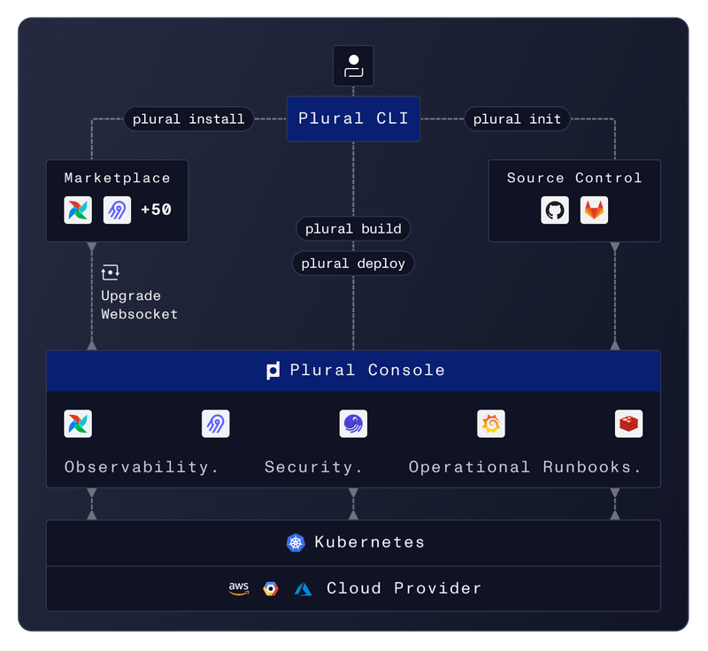

# Contributing
From opening a bug report to creating a pull request: every contribution is appreciated and welcome.


## Development

Plural's server side is written in elixir, and exposes a graphql api. The frontend is in react, all code lives in this single repo and common development tasks can be done using the Makefile at the root of the repo.


### Developing Web
To begin developing the web app, install [node](https://nodejs.org/en/download/) & [yarn](https://classic.yarnpkg.com/en/docs/getting-started/), then run:

```sh
cd www && yarn install && cd ..
make web
```

In chrome, you may get a warning saying "Your connection is not private". To resolve it, enable the `chrome://flags/#allow-insecure-localhost` flag and restart your browser.

### Developing Server

To make changes to the server codebase, you'll want to [install elixir](https://elixir-lang.org/install.html) on your machine. For mac desktops, we do this via [asdf](https://asdf-vm.com/guide/getting-started.html), which can be done simply at the root of the repo like so:

```sh
asdf plugin add erlang
asdf plugin add elixir
asdf install
```

asdf can be finnicky when instlalling erlang with mac, in which case you can reshim it like so from homebrew:

```sh
brew install erlang@23
cp -r /opt/homebrew/opt/erlang@23/lib/erlang ~/.asdf/installs/erlang/23.2
asdf reshim erlang 23.2
```

<!-- >
  Remove this line if irrelevant in the future
</!-->
In case you're running into this error: `configure: error: cannot find required auxiliary files: install-sh config.guess config.sub` you may consider this [GitHub issue](https://github.com/asdf-vm/asdf-erlang/issues/195#issuecomment-815999279) then re-run `asdf install`.

All server dependencies are managed via [docker-compose](https://www.docker.com/):

```sh
docker compose up
```

Initializing the db can be done with:

```sh
mix ecto.setup
```

Tests can be run via `mix`, like so:

```sh
make testup
mix test
```

Working on the emails can be done with:

```sh
cd apps/email && iex -S mix phx.server
```

Then sending a text email can be done with:

```sh
Email.Helper.confirm_email("foo@plural.sh")
```

Your email will show up at http://localhost:4002/sent_emails


### Server Architecture

</img>

The Plural server codebase uses an elixir umbrella application to organize itself, and splits into three main deployments:

* api - hosting the main graphql api
* worker - background workers, for things like upgrade delivery and artifact scanning
* rtc - for all websocket facing communication

These apps will all depend on core, where most Plural business logic should live, and their releases are configured under `/rel`.

### Email Development

We use elixir's bamboo framework for templating and delivering emails, one benefit of which is it creates a local server to view in-progress emails.  You can get this set up by doing:

```bash
mix ecto.create && mix ecto.migrate # ensure your dev db is set up
cd apps/email && iex -S mix phx.server
```

You should be able to view your emails at http://localhost:4002/sent_emails

You'll need to send an email to see them, which you can use the iex repl to do for you.

To actually write an email, you'll want to modify the templates in `apps/email/lib/email_web/templates/email` and the layout is in `apps/email/lib/email_web/templates/layout/email.html.eex`

## Adding a new application to the marketplace

See docs on our [docs site](https://docs.plural.sh/applications/adding-new-application) for how to add applications to the marketplace.
