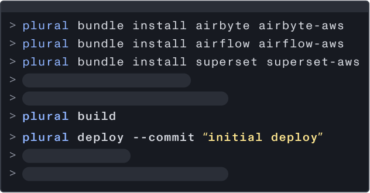

<p align="center">
  
</p>

<h3 align="center">
  The fastest way to build great infrastructure
</h3>

<p align="center">
  Plural empowers you to build and maintain cloud-native and production-ready open source infrastructure on Kubernetes.
</p>

<h3 align="center">
  🚀🔨☁️
</h3>

<p align="center">
  
  <br/>
</p>

<p align="center">
  <a href="https://discord.gg/CKc2kfeXxQ" target="_blank">
    
  </a>
  <a href="#contributing">
    
  </a>
  
  
  
  
  
  
</p>


## ✨ Features

Plural will deploy open source applications on Kubernetes in your cloud using common standards like helm and terraform.

The Plural platform provides the following:

* Dependency management between Terraform/Helm modules, with dependency-aware deployment and upgrades.
* Authenticated docker registry and chartmuseum proxy per repository.
* Secret encryption using AES-256 (so you can keep the entire workflow in git).

In addition, Plural also handles:
* Issuing the certificates.
* Configuring a DNS service to register fully-qualified domains under onplural.sh to eliminate the hassle of DNS registration for users.
* Being an OIDC provider to enable zero touch login security for all Plural applications.

We think it's pretty cool! 😎 Some other nice things:

### ☁️ Build and manage open cloud-native architectures
The plural platform ingests all deployment artifacts needed to deploy cloud-native applications and tracks their dependencies, allowing for seamless installations and no-touch upgrades post-install. All applications are managed via GitOps, allowing you to reconfigure them at will, or even eject them from Plural entirely. It's your application, we just want to help you use it as easily as possible.

### 🤖 Day-2 Operational Toolkit
Scale to meet demand with one-click operational run-books for key cluster operations. Every dependency automatically upgraded in the correct order, in a rolling manner. Plural provides a timestamped audit trail for all cluster applications along with searchable, downloadable logs. In addition, there are also pre-packaged insights and dashboards for the highest importance metrics—from day one.

### 🔓 Secure by default
Plural performs regular security scans for application images, helm charts, and terraform modules and comes equiped with OpenID connect for seamless user auth to applications deployed by Plural.

### 🥳 Open source and extensible
All Plural applications are fully customizable and able to be ejected at any time. New applications can be wrapped and packaged onto Plural easily, giving you total freedom about how, when and where to use Plural.
<br/><br/>


## 📽 Check out a video Demo

https://user-images.githubusercontent.com/28541758/164427949-3f14cfbb-cf5e-40dc-8996-385691ec2f01.mp4

<br /><br />


## 🏁 Getting Started

1. Go to https://app.plural.sh to create an account.<br /> 
*Note: This is simply to track your installations and allow for the delivery of automated upgrades, you will not be asked to provide any infrastructure credentials or sensitive information.*
3. Install the Plural CLI by following steps 1, 2, and 3 of the [Getting Started guide](https://docs.plural.sh/getting-started).
4. [Create and initialize a new git repo](https://docs.plural.sh/getting-started#4.-create-and-initialize-plural-repo) to store your Plural installation.
5. Install, build and deploy applications from the Plural catalogue by following steps 5 and 6 of the [Getting Started guide](https://docs.plural.sh/getting-started#5.-install-plural-applications).
6. [Install the Plural Management Console](https://docs.plural.sh/getting-started#7.-install-plural-admin-console).

You should now have a fully functioning Plural environment with apps and the management console running. For more details or further information check out the rest of the docs below.

### The Plural Workflow

The workflow is literally two commands:

```bash
plural build
plural deploy
```

Our tooling will take care of the rest.
<br /><br />


## 📚 Documentation

* The full documentation is available on our [Documentation site](https://docs.plural.sh/).
<br /><br />


## 💬 Community

For general help, please refer to the Plural documentation. For additional help you can use the following channels:

* [Discord](https://discord.gg/CKc2kfeXxQ) (For live discussions with the Plural team).
* [GitHub](https://github.com/pluralsh/plural/) (Bug reports, feature requests, contributions).
* [Twitter](https://twitter.com/plural_sh) (For our latest news).

Plural is dedicated to providing a welcoming, diverse, and harrassment-free experience for everyone. We expect everyone in the community to abide by our [Code of Conduct](CODE_OF_CONDUCT.md). *Please read it.*
<br /><br />

## 🎁 Get Free Swag!

Get free Plural swag [here](https://pluralsh.typeform.com/to/jMj5GaM4)! :-)
<br /><br />


## 🚗 Roadmap
See what we're working on in these GitHub projects. Help us prioritize issues by reacting with an emoji on the issue!
* Application Onboarding Roadmap: https://github.com/orgs/pluralsh/projects/2/views/2
* Plural Core Issues: https://github.com/pluralsh/plural/issues
* Plural CLI Issues: https://github.com/pluralsh/plural-cli/issues
<br /><br />


## 🙌 Contributing to Plural

We love contributions to Plural, big or small! To learn more about the repo and the architecture, see our [Contribution Guide](CONTRIBUTING.md). <br />

If you're not sure where to start, or if you have any questions, please open a draft PR or visit our [Discord](https://discord.gg/CKc2kfeXxQ) server where the core team can help answer your questions.
<br /><br />


## 📝 License

See [LICENSE](LICENSE) for licensing information. If there are any questions on the license please visit our [Discord](https://discord.gg/CKc2kfeXxQ). 
