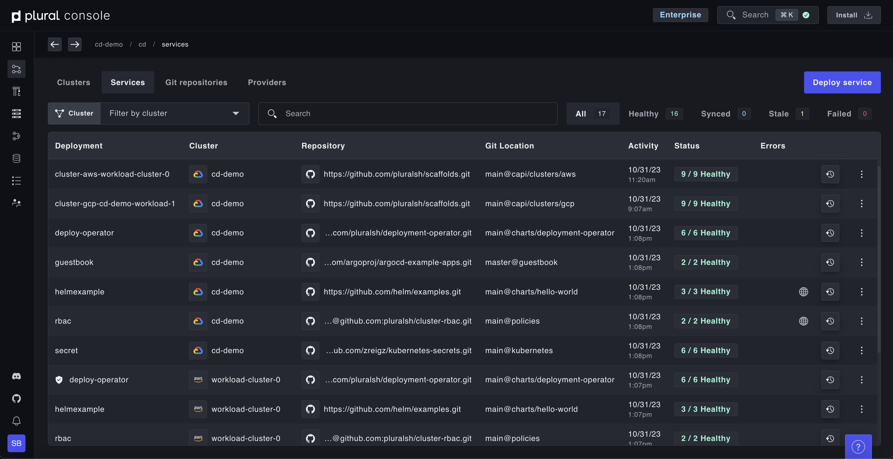
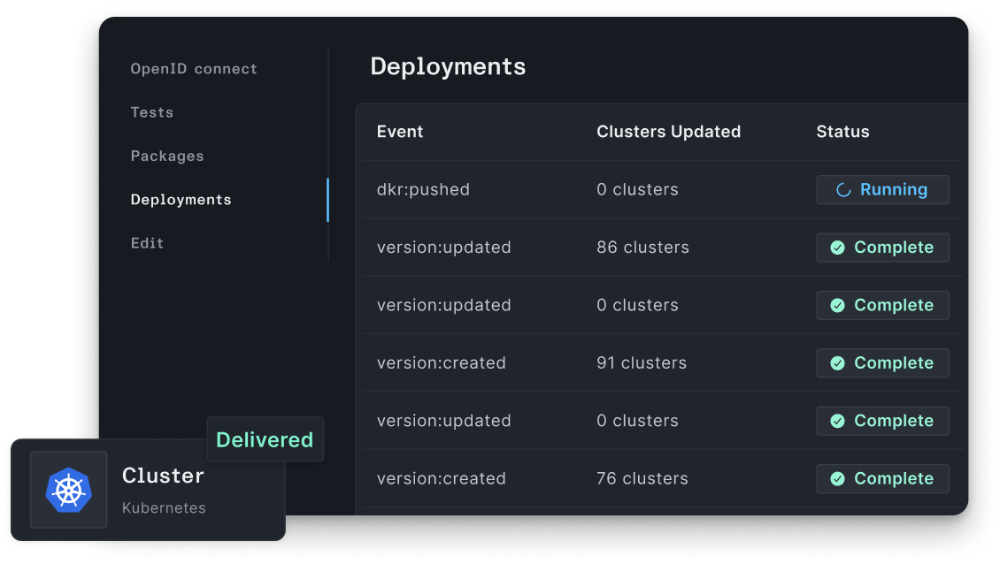
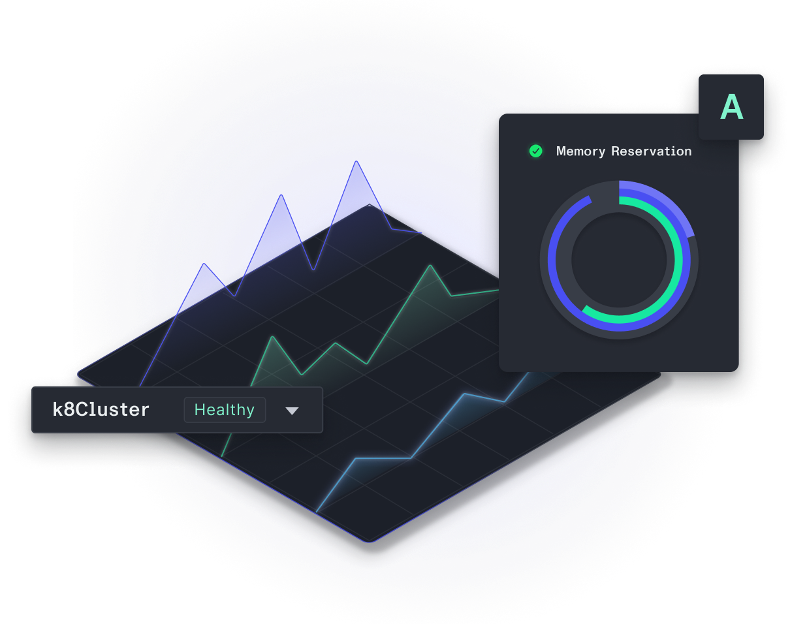

  

<h3 align="center">
  The fastest way to build great infrastructure and deploy your software
</h3>

  Plural empowers you to build and maintain cloud-native and production-ready infrastructure on Kubernetes.

<h3 align="center">
  🚀🔨☁️
</h3>

  
   

  
  
  
  
  
  
  
  

## ✨ Features

Use Plural to manage your Kubernetes Fleet from a single pane of glass.

The Plural platform provides the following:

* Cluster API Providers to create and manage clusters at scale.
* Full visibility of your fleet and all deployed services via our secure Auth Proxy.
* Configuration management for deployments, allowing you to parameterize services for each deployment.
* Horizontal scaling to ingest and auto-shard as many repos as necessary.
* Configurable pipelines for testing out code changes.
* PR automation to generate PRs for updates, new repositories, and more.

We think it's pretty cool! 😎 Some other nice things:

### ☁️ Build and manage open cloud-native architectures

   
  
    

The Plural platform also ingests all deployment artifacts needed to deploy open-source cloud-native applications, allowing for easy installs and no-touch upgrades post-install.

### 🤖 Day-2 Operational Toolkit

  
   

Monitor all your installations from one central control plane. Our Auth Proxy makes it easy to make secure Kubernetes API calls to give you full dashboarding capabilities for all your clusters, regardless of where they live without direct network access. 

Spin up ephemeral environments to test out new configurations in seconds; our CAPI providers make it easy to modify your architecture as you need it. 

Manage Kubernetes upgrades easily with our built-in Kubernetes API deprecation management - we surface all endpoints on all clusters that need to be addressed.

### 🔓 Secure by default
Plural is fully self-hosted within your own environment, meaning we don't touch your credentials or sensitive information. 

Cluster setup includes deploying our Plural deployment operator, which efficiently polls the control plane for any changes that need to be applied. This ensures that our control plane doesn’t reach into these workload clusters, providing a more secure setup than push-based models.

### 🥳 Flexible configuration
All Plural deployments are fully customizable with our centralized secrets management. Additionally, we natively support deploying to brand new clusters or adopting existing K8s clusters.
  

## 📽 Check out a video Demo

  

https://github.com/pluralsh/plural/assets/1610133/43f8d4c5-c74b-4098-97e9-39c9ed302a16

## 🏁 Getting Started

1. Go to https://app.plural.sh to create an account. 
*Note: This is simply to track your open-source installations and deploy your Console; if you use our CLI you will not be asked to provide any infrastructure credentials or sensitive information.*
2. [Install the Plural CLI](https://docs.plural.sh/getting-started/getting-started#install-plural-cli)
3. [Create and initialize a new git repo](https://docs.plural.sh/getting-started/getting-started#create-your-plural-repo) to store your Plural installation.
4. [Install, build and deploy Plural Console](https://docs.plural.sh/basic-setup-and-deployment/admin-console) and [any other applications](https://docs.plural.sh/getting-started/getting-started#install-plural-applications) from the Plural marketplace.

You should now have a fully functioning Plural environment with any open-source apps and the management console running. From here, you can spin up additional clusters, deploy your services, track upgrades, and more. For more details or further information check out the rest of the docs below.

## 📚 Documentation

The full documentation is available on our [Documentation site](https://docs.plural.sh/).
  

## 💬 Community

For general help, please refer to the Plural documentation. For additional help you can use the following channels:

* [Discord](https://discord.gg/pluralsh) (For live discussions with the Plural team).
* [GitHub](https://github.com/pluralsh/plural/) (Bug reports, feature requests, contributions).
* [Twitter](https://twitter.com/plural_sh) (For our latest news).

Plural is dedicated to providing a welcoming, diverse, and harassment-free experience for everyone. We expect everyone in the community to abide by our [Code of Conduct](CODE_OF_CONDUCT.md). *Please read it.*
  

## 🚗 Roadmap
See what we're working on in these GitHub projects. Help us prioritize issues by reacting with an emoji on the issue!
* Application Onboarding Roadmap: https://github.com/orgs/pluralsh/projects/2/views/2
* Plural Core Issues: https://github.com/pluralsh/plural/issues
* Plural CLI Issues: https://github.com/pluralsh/plural-cli/issues
  

## 🙌 Contributing to Plural

We love contributions to Plural, big or small! To learn more about the repo and the architecture, see our [Contribution Guide](CONTRIBUTING.md).  

If you're not sure where to start, or if you have any questions, please open a draft PR or visit our [Discord](https://discord.gg/pluralsh) server where the core team can help answer your questions.
  

## 📝 License

See [LICENSE](LICENSE) for licensing information. If there are any questions on the license please visit our [Discord](https://discord.gg/pluralsh).

## Thanks to all the contributors ❤
 
